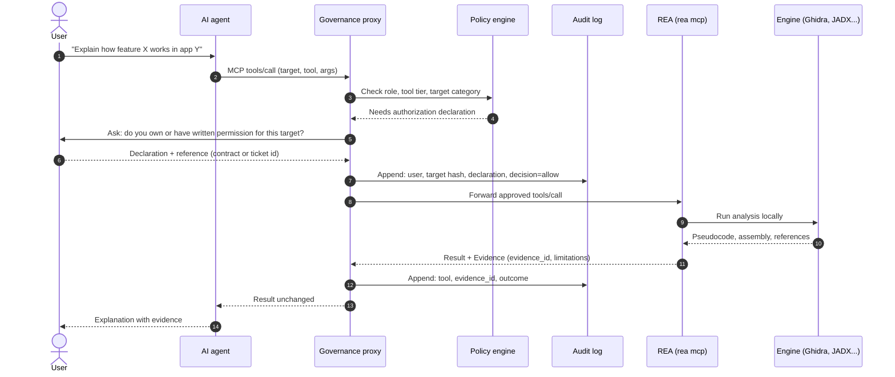
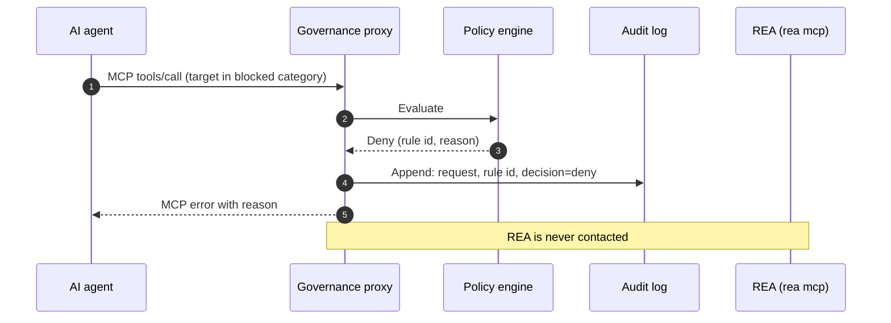
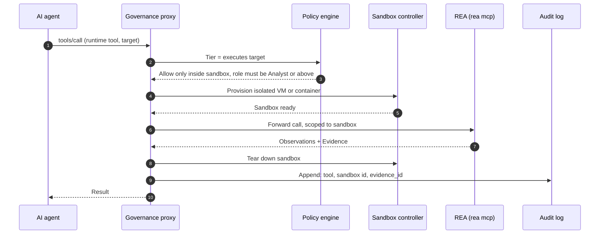

# Sequence diagrams

Status: **proposed design**.

## 1. Approved analysis request

```mermaid
sequenceDiagram
    autonumber
    actor U as User
    participant A as AI agent
    participant G as Governance proxy
    participant P as Policy engine
    participant L as Audit log
    participant R as REA (rea mcp)
    participant E as Engine (Ghidra, JADX...)

    U->>A: "Explain how feature X works in app Y"
    A->>G: MCP tools/call (target, tool, args)
    G->>P: Check role, tool tier, target category
    P-->>G: Needs authorization declaration
    G->>U: Ask: do you own or have written permission for this target?
    U-->>G: Declaration + reference (contract or ticket id)
    G->>L: Append: user, target hash, declaration, decision=allow
    G->>R: Forward approved tools/call
    R->>E: Run analysis locally
    E-->>R: Pseudocode, assembly, references
    R-->>G: Result + Evidence (evidence_id, limitations)
    G->>L: Append: tool, evidence_id, outcome
    G-->>A: Result unchanged
    A-->>U: Explanation with evidence
```

## 2. Denied request

```mermaid
sequenceDiagram
    autonumber
    participant A as AI agent
    participant G as Governance proxy
    participant P as Policy engine
    participant L as Audit log
    participant R as REA (rea mcp)

    A->>G: MCP tools/call (target in blocked category)
    G->>P: Evaluate
    P-->>G: Deny (rule id, reason)
    G->>L: Append: request, rule id, decision=deny
    G-->>A: MCP error with reason
    Note over G,R: REA is never contacted
```

## 3. Runtime-capture tool (runs the target)

```mermaid
sequenceDiagram
    autonumber
    participant A as AI agent
    participant G as Governance proxy
    participant P as Policy engine
    participant S as Sandbox controller
    participant R as REA (rea mcp)
    participant L as Audit log

    A->>G: tools/call (runtime tool, target)
    G->>P: Tier = executes target
    P-->>G: Allow only inside sandbox, role must be Analyst or above
    G->>S: Provision isolated VM or container
    S-->>G: Sandbox ready
    G->>R: Forward call, scoped to sandbox
    R-->>G: Observations + Evidence
    G->>S: Tear down sandbox
    G->>L: Append: tool, sandbox id, evidence_id
    G-->>A: Result
```
